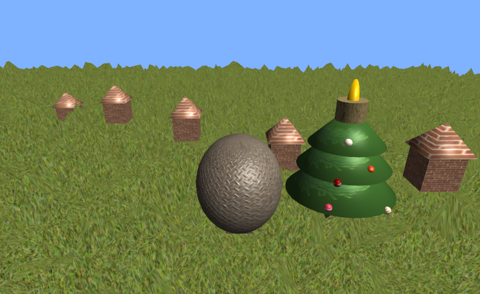

#  Christmas Delivery - 3D Delivery Game

Учебный проект - небольшая 3D-игра про доставку праздничных посылок на дирижабле.

## 📸 Демонстрация



##  Игровой процесс

Игрок управляет дирижаблем, летает над 3D-ландшафтом и сбрасывает посылки на праздничные домики. Цель игры - поразить все цели, находящиеся на карте.

### Управление

| Клавиша | Действие |
|---------|----------|
| `W` | Движение вперед |
| `S` | Движение назад |
| `A` | Движение влево |
| `D` | Движение вправо |
| `Space` | Подъем вверх |
| `LControl` | Спуск вниз |
| `P` | Сбросить посылку |
| `C` | Переключить режим камеры (вид от первого лица/общий план) |

## Технологии

- **C++** - основной язык программирования
- **SFML** - создание окна и загрузка текстур
- **OpenGL** - рендеринг 3D-графики
- **GLAD** - загрузка OpenGL функций
- **GLM** - математические операции для 3D-графики

##  Особенности реализации

### 3D модели
Процедурная генерация 3D-объектов:
- **Террейн** - ландшафт, сгенерированный на основе карты высот
- **Ёлка** - состоит из ствола и трёх конусовидных ярусов
- **Дирижабль** - эллипсоид с гондолой
- **Домики** - куб с конической крышей
- **Посылки** - кубики

### Визуальные эффекты
- **Текстурирование** - все объекты имеют текстуры
- **Normal Mapping** - для дирижабля использована карта нормалей
- **Динамическое освещение** - направленный свет с расчетом теней
- **Камера** - два режима: свободный обзор и вид от первого лица

### Игровая логика
- Физика падения посылок с учетом гравитации
- Столкновения с ландшафтом и целями
- Система подсчета очков при попадании в цель
- Автоматическое определение высоты ландшафта для размещения объектов

##  Структура проекта

```
├── main.cpp          # Основной код игры
├── assets/           # Папка с текстурами
│   ├── grass.jpg
│   ├── tree_bark.jpg
│   ├── tree_leaves.jpg
│   ├── airship_tex.jpg
│   ├── airship_normal.jpg
│   ├── house_tex.jpg
│   ├── parcel_tex.jpg
│   ├── heightmap.jpg
│   ├── ball_tree1-5.jpg
│   └── star.jpg
├── scene.png         # Скриншот игровой сцены
└── README.md         # Документация
```

##  Сборка проекта

### Требования
- CMake (версия 3.10+)
- Компилятор с поддержкой C++17
- Установленные библиотеки: SFML, OpenGL, GLAD, GLM

### Инструкция по сборке

```bash
# Клонирование репозитория
git clone <repository-url>
cd christmas-delivery

# Создание папки для сборки
mkdir build && cd build

# Генерация файлов сборки
cmake ..

# Компиляция
make

# Запуск
./ChristmasDelivery
```

##  Примечания

- Игра использует текстуры из папки `assets/` - убедитесь, что они находятся в корневой папке при запуске
- Карта высот (`heightmap.jpg`) определяет рельеф игрового мира
- Для работы нормал-маппинга требуется поддержка OpenGL 3.3+


